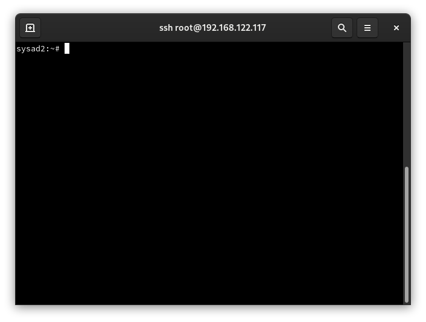
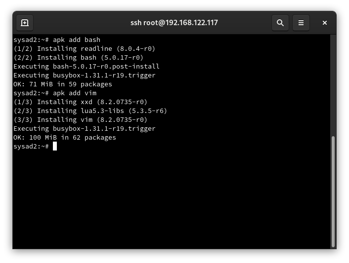
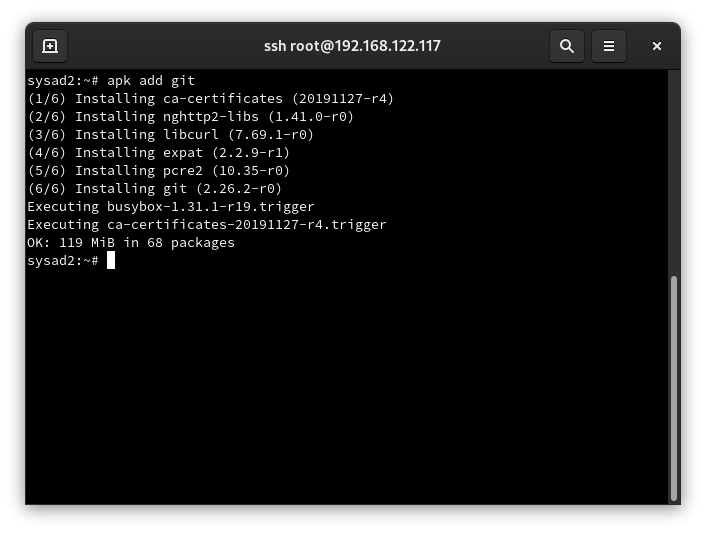
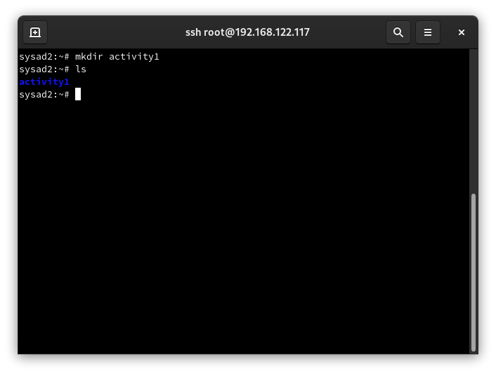
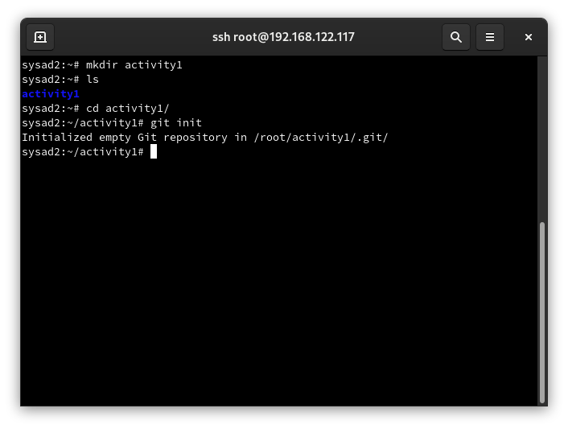
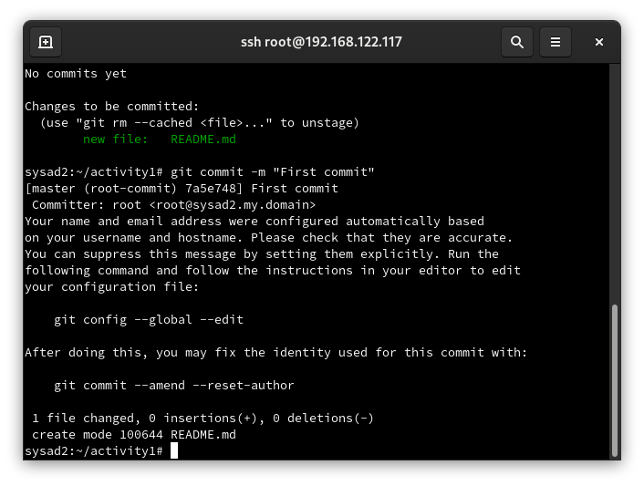

<html lang="{{ site.lang | default: "en-US" }}">
  <head>
    <meta charset="utf-8">
    <meta http-equiv="X-UA-Compatible" content="IE=edge">


    <link rel="stylesheet" href="{{ '/assets/css/style.css?v=' | append: site.github.build_revision | relative_url }}">
    
    
    <!--[if lt IE 9]>
      
    <![endif]-->
    <!--[if lt IE 8]>
    <link rel="stylesheet" href="{{ '/assets/css/ie.css' | relative_url }}">
    <![endif]-->
    <link rel="stylesheet" href="assets/css/main.css" />
    <noscript><link rel="stylesheet" href="assets/css/noscript.css" /></noscript>

  </head>
  <body class="is-preload">
    

        

           
          <h1>Hands-on Activity 1: Install and configure your repository in Local Git</h1>
           
          
By: John David Lamzon

           
          <nav id="nav">
						<ul class="links">
							<li class="active"><a href="index.html">PRELIM</a></li>
							<li><a href="generic.html">MIDTERM</a></li>
							<li><a href="elements.html">FINALS</a></li>
					  </ul>
          </nav>
           
          

          Project maintained by <a href="{{ site.github.owner_url }}">{{ site.github.owner_name }}</a>
        
   
            <article class="post h-entry" itemscope="" itemtype="http://schema.org/BlogPosting">
 
  <header class="post-header">
    <h1 class="post-title p-name" itemprop="name headline">Prelim: Hands-on Activity 1</h1>
  </header>
  

    
    

     
    <ol>
    <li>
    
Document your work and email to your instructor

    </li>
    <li>
    
Access your alpine VM via ssh or locally via console.

    
    </li>
    <li>
    
Install bash and vim with apk add bash and apk add vim.

    
    </li>
    <li>
    
Install Git using apk add git

    
    </li>
    <li>
    
Create a directory named activity1

    
    </li>
    <li>
    
Initialize Git using git init)

    
    </li>
    
To check the status of the repository use git status and to add a file in the repository history use git add (to simulate you can create a file first)

    
    <li>
    
To commit the changes in the repository use git commit -m "Your commit message"

    
    </li>
    </ol>

    

        

        

        

    

    

        &copy; jdlamzon-tip.github.io | Designed by John David Lamzon
        

    <table class="table-footer-main">
    <tr>
    <td class="footer-head" colspan="3">SYSAD2 FINAL PROJECT
    </td>
    </tr>
    <tr>
    <td class="footer=cell">SYSAD2 FINAL PROJECT 
qjdalamzon@tip.edu.ph</td>
    <td class="footer=cell">eacena-tip</td>
    <td class="footer=cell">Contains all the hands-on activity,quiz, and major exam in System Adminitration 2 course.</td>
    </tr>
    </table>

  
